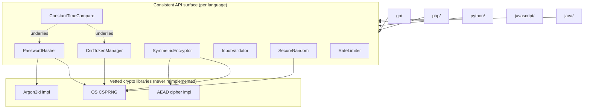

<p align="center">
  
</p>

<h1 align="center">Buddha is My Shelter</h1>
<p align="center"><em>a misuse-resistant security toolkit, previously known as securekit</em></p>

[](https://github.com/kevinsorensen523/buddha-is-my-shelter/actions/workflows/ci.yml)
[](LICENSE)

A misuse-resistant security toolkit for application developers, implemented
with **feature parity across five languages**: Go (reference), PHP, Python,
JavaScript/Node.js, and Java.

Buddha is My Shelter wraps OWASP best practices into APIs that are
**secure by default** and **hard to use wrong** — no nonce parameters to get
right, no manual constant-time comparisons to forget, no cost factors to
guess. Every cryptographic primitive is delegated to a vetted, audited
library per language (see the table below). **This toolkit never implements
its own cryptography.**

## Why

Most security bugs in application code aren't cryptographic breaks — they're
misuse: reused nonces, `==` comparisons on secrets, `Math.random()` used for
tokens, leaky error messages that turn decryption into an oracle. This
toolkit's API surface is designed so those mistakes are difficult to make.

## Feature Matrix

| Module | Go | PHP | Python | JavaScript | Java |
|---|:---:|:---:|:---:|:---:|:---:|
| SecureRandom | ✅ | ✅ | ✅ | ✅ | ✅ |
| PasswordHasher (Argon2id) | ✅ | ✅ | ✅ | ✅ | ✅ |
| SymmetricEncryptor (AEAD) | ✅ | ✅ | ✅ | ✅ | ✅ |
| InputValidator / Sanitizer | ✅ | ✅ | ✅ | ✅ | ✅ |
| CsrfTokenManager | ✅ | ✅ | ✅ | ✅ | ✅ |
| RateLimiter | ✅ | ✅ | ✅ | ✅ | ✅ |
| ConstantTimeCompare | ✅ | ✅ | ✅ | ✅ | ✅ |

## Vetted Cryptography per Language

| Language | Random | Password Hash | AEAD Encryption |
|---|---|---|---|
| Go | `crypto/rand` | `golang.org/x/crypto/argon2` | `golang.org/x/crypto/chacha20poly1305` (XChaCha20-Poly1305) |
| PHP | `random_bytes` | `password_hash(PASSWORD_ARGON2ID)` | ext-`sodium` (XChaCha20-Poly1305) |
| Python | `secrets` | `argon2-cffi` | `cryptography` hazmat AEAD (ChaCha20-Poly1305) |
| JavaScript | `crypto.randomBytes` | `argon2` (bcrypt fallback via `bcryptjs`) | Node `crypto` (AES-256-GCM) |
| Java | `java.security.SecureRandom` | Bouncy Castle Argon2 | JCE `javax.crypto` (AES-256-GCM) |

No module ever exposes an API to choose your own nonce/IV — it is always
generated internally per-call. No decryption error message ever reveals
*why* decryption failed.

**Note:** `PasswordHasher` and `CsrfTokenManager` produce a wire format
that's portable across all five languages (verified by
[`vectors/`](vectors/) — see below). `SymmetricEncryptor` is **not**
fully portable: Go+PHP (XChaCha20-Poly1305), JS+Java (AES-256-GCM), and
Python (ChaCha20-Poly1305) each form their own compatibility island. See
[THREAT_MODEL.md](THREAT_MODEL.md#symmetricencryptor-aead) for detail.

## Architecture



## Quick Start

<details>
<summary><strong>Go</strong></summary>

```bash
go get github.com/kevinsorensen523/buddha-is-my-shelter/go@latest
```

```go
hasher := securekit.NewDefaultPasswordHasher()
hash, _ := hasher.Hash("correct horse battery staple")
```

Full docs: [go/README.md](go/README.md)
</details>

<details>
<summary><strong>PHP</strong></summary>

```bash
composer require kevinsorensen523/buddha-is-my-shelter
```

```php
$hasher = new SecureKit\PasswordHasher();
$hash = $hasher->hash('correct horse battery staple');
```

Full docs: [php/README.md](php/README.md)
</details>

<details>
<summary><strong>Python</strong></summary>

```bash
pip install buddha-is-my-shelter
```

```python
from securekit import PasswordHasher
hasher = PasswordHasher()
hashed = hasher.hash("correct horse battery staple")
```

Full docs: [python/README.md](python/README.md)
</details>

<details>
<summary><strong>JavaScript / Node.js</strong></summary>

```bash
npm install @kevinsorensen523/buddha-is-my-shelter
```

```js
const { PasswordHasher } = require('@kevinsorensen523/buddha-is-my-shelter');
const hasher = new PasswordHasher();
const hash = await hasher.hash('correct horse battery staple');
```

Full docs: [javascript/README.md](javascript/README.md)
</details>

<details>
<summary><strong>Java</strong></summary>

```xml
<dependency>
  <groupId>io.github.kevinsorensen523</groupId>
  <artifactId>buddha-is-my-shelter</artifactId>
  <version>0.1.0</version>
</dependency>
```

```java
PasswordHasher hasher = new PasswordHasher();
String hash = hasher.hash("correct horse battery staple");
```

Full docs: [java/README.md](java/README.md)
</details>

## Repository Layout

```
buddha-is-my-shelter/
├── go/            reference implementation (go.mod)
├── php/           (composer.json)
├── python/        (pyproject.toml)
├── javascript/    Node.js port (package.json)
├── java/          (pom.xml)
├── examples/      framework integration examples per language
├── SECURITY.md    vulnerability reporting policy
├── THREAT_MODEL.md what each module protects against, and what it doesn't
└── .github/workflows/ci.yml   per-language test + security-lint matrix
```

## Cross-Language Interop Testing

[`vectors/`](vectors/) holds JSON fixtures — a hash, a token, a ciphertext —
generated once by each language's own implementation. Every port has an
interop test (`interop_test.go`, `InteropTest.php`, `test_interop.py`,
`interop.test.js`, `InteropTest.java`) that loads these fixtures and asserts
it can correctly consume what every *other* language produced. This is what
actually proves the wire-format claims in this README, rather than just
asserting them by hand — and it's exactly how the `SymmetricEncryptor`
compatibility-island finding above was discovered.

## Documentation

- [SECURITY.md](SECURITY.md) — how to report a vulnerability
- [THREAT_MODEL.md](THREAT_MODEL.md) — guarantees and non-guarantees per module
- [CONTRIBUTING.md](CONTRIBUTING.md) — development workflow
- [CHANGELOG.md](CHANGELOG.md) — release history

## License

MIT — see [LICENSE](LICENSE).
